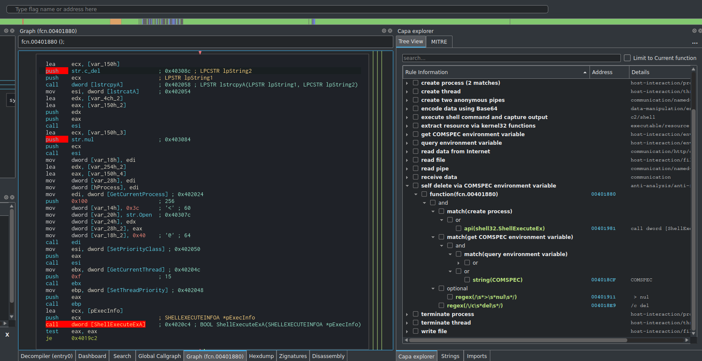

# capa-explorer

## Installation

First locate the directory used by cutter for loading plugins.

The simplest way to do this is to open cutter and go to Edit menu -> Preferences -> Plugins.
The directory you are looking for should be displayed at the top.

Inside that directory you should find a directory named python. Download or clone this repository, and move capa_explorer_plugin to the python directory.

## Usage

Use capa standalone which can be downloaded here

https://github.com/fireeye/capa/releases/

Issue the following command to create a JSON report of the binary.

`capa.exe -j sample.exe > sample.exe.json`

Open the binary in Cutter and and press "Load capa JSON" button in the capa explorer widget to load the report.

## Known limitations
- The plugin currently uses r2's ecH command to highlight instructions, while this works the support seems limited in Cutter and at times it can be slow. Ideally BIHighlighter should be used but due to a bug this is currently not exposed in CutterCore. https://github.com/radareorg/cutter/issues/2395
- The main difference between this plugin and the IDA version is that this plugin does not implement a feature extractor and relies on th JSON exports from the IDA plugin or the standalone tool. I have not looked into the possibility of implementing feature extraction with radare2. This may or may not be something I do in the future.  

## Credits
I want to thank FireEye and the FLARE team for creating this tool and making it availible to everyone. Most of the code in this repo is taken directly from the official capa IDA plugin and and have received slight modifications to make it work in Cutter. The main goal was to make the user experice as close as possible to the original plugin.

https://github.com/fireeye/capa

Also a big thanks to the creators of radare2 and Cutter.

https://github.com/radareorg/cutter
